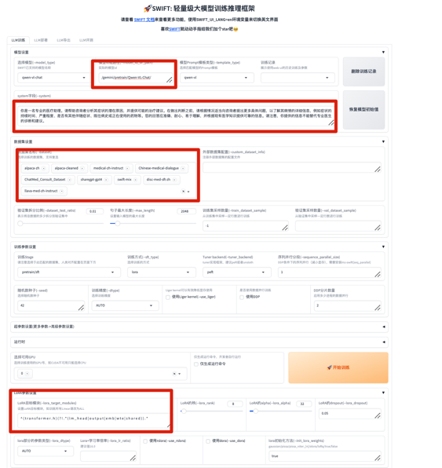
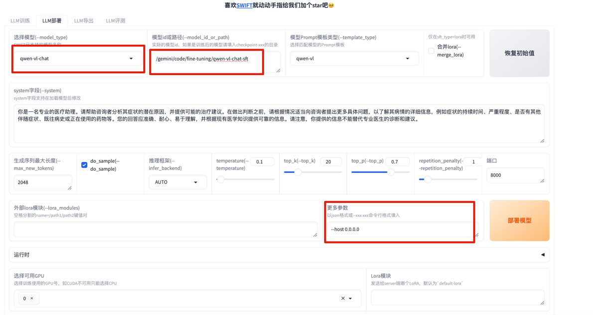

## Swift Lora微调
### 参考文档
   - Qwen-VL-Chat sft parameters:https://github.com/modelscope/ms-swift/blob/main/examples/pytorch/llm/scripts/qwen_vl_chat/lora/sft.sh
   - webui parameters: https://swift.readthedocs.io/en/latest/LLM/Command-line-parameters.html#web-ui-parameters
   - eval parameters: https://swift.readthedocs.io/en/latest/LLM/Command-line-parameters.html#eval-parameters
### 准备环境
    - git clone https://github.com/modelscope/swift.git
    - cd swift
    - pip install -e '.[all]'
    - swift web-ui --lang zh --host 0.0.0.0 --port 7860 
    - 也可以直接使用微调命令，参考下面的指令，参数值根据需要自己修改：
        - nohup swift sft --model_id_or_path '/gemini/code/fine-tuning/qwen-vl-chat-image-text-text' --template_type 'qwen-vl' --system '你是一名专业的医疗助理。请帮助咨询者分析其症状的潜在原因，并提供可能的治疗建议。在做出判断之前，请根据情况适当向咨询者提出更多具体问题，以了解其病情的详细信息，例如症状的持续时间、严重程度、是否有其他伴随症状、既往病史或正在使用的药物等。您的回答应准确、耐心、易于理解，并根据现有医学知识提供可靠的信息。请注意，您提供的信息不能替代专业医生的诊断和建议。' --dataset disc-med-sft-zh swift-mix medical-zh-instruct sharegpt-gpt4 --train_dataset_sample '200000' --lora_target_modules DEFAULT --init_lora_weights 'True' --batch_size '4' --learning_rate '1e-4' --num_train_epochs '6' --gradient_accumulation_steps '16' --eval_steps '500' --save_steps '500' --output_dir '/gemini/code/swift/output/qwen-vl-chat/v24-20240831-005753' --warmup_ratio '0.03' --eval_batch_size '1' --max_grad_norm '0.5' --model_type 'qwen-vl-chat' --lazy_tokenize True --add_output_dir_suffix False --output_dir /gemini/code/swift/output/qwen-vl-chat/v24-20240831-005753/ --logging_dir /gemini/code/swift/output/qwen-vl-chat/v24-20240831-005753/runs --ignore_args_error True > /gemini/code/swift/output/qwen-vl-chat/v24-20240831-005753/runs/run.log 2>&1 &
    - 如果使用Web UI，启动界面如下所示

### LLM训练：
    - SWIFT对支持的模型提供了参考的训练参数，请查看参考文档
    - SWIFT自带一些SFT数据，选择数据集后支持自动下载：https://swift.readthedocs.io/en/latest/LLM/Supported-models-datasets.html#Datasets
    - 同样支持自定义数据集,数据集格式：https://swift.readthedocs.io/en/latest/LLM/Customization.html#custom-dataset
### LLM部署
    - 模型部署支持先导出模型后部署，或训练完之后直接部署。直接部署需要merge-lora, merge-lora需要填写使用的check point地址,比如 --ckpt_dir /gemini/code/swift/output/qwen-vl-chat/v8-20240829-011007/checkpoint-500
    - 导出后部署参考下面界面

### LLM评测
    - SWIFT框架评测也提供了一些数据集，同样也支持自定义数据集，参考：https://swift.readthedocs.io/en/latest/LLM/LLM-eval.html#Custom-Evaluation-Set
    - 评测命令参考：swift eval --model_type qwen-vl-chat --model_id_or_path /gemini/code/fine-tuning/checkpoint-500-merged --name qwen-vl-chat-eval --eval_dataset ARC_e InfoVQA_VAL COCO_VAL OCRVQA_TEST --eval_limit 300 --lazy_tokenize True --log_file /gemini/code/swift/output/qwen-vl-chat-2024829141527/run_eval.log --ignore_args_error true
 
